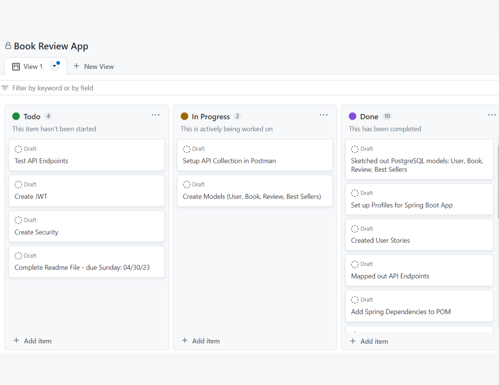
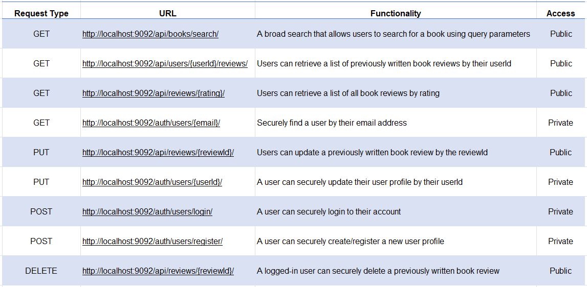

# Book Review API :open_book::feather:
<h2>Introduction:books:</h2>

Are you ready to embark on a journey to learn about the powerful world of APIs? An API, or Application 
Programming Interface, is a collection of protocols, routines, and tools that enable software applications 
to communicate and exchange information with one another. The goal of this mini project is to build a 
robust backend using Spring Boot and its various modules to create a Book Review API. The building approach
for this project is monolithic, utilizing PostgreSQL as the database and deploying the app on the Tomcat server.

<h2>Installation</h2>

First, you will need to install the following:

<ol>
<li> First, download IntelliJ IDE if you don't have it on your computer. </li>
<li> Next, download PostgreSQL and create a database called "bookapi". </li>
<li> Then, download Postman to test the API. </li>
<li> Also, make sure to include the Spring dependencies in your pom.xml file.</li>
<li> After downloading your tools, clone this repository.</li>
<li> Open the files in IntelliJ and run the application.</li>
</ol>
<h2>Technical Requirements</h2>

For this project, the following technologies were included:

<ul>
<li>The PostgreSQL database includes five models: Author, Book, Review, User, and User Profile:white_check_mark:</li>
<li>The environment settings are set up using Spring Profiles:white_check_mark:</li>
<li>A combination of Spring Security and JWT tokens used to authenticate and personalize the API endpoints:white_check_mark:</li>
<li>API endpoints and their functionality included to complete CRUD operations (create, read, update, and delete):white_check_mark:</li>
<li>Additional API endpoints are included to perform CRUD tasks based on the business logic and user stories:white_check_mark:</li>
<li>CRUD routes built on rest conventions are provided:white_check_mark:</li>
<li>Various exception handles are included to handle unexpected occurrences with the appropriate message:white_check_mark:</li>
<li>The controllers and services are separate to conform to the MVC design pattern:white_check_mark:</li>
</ul>
<h1>The Planning Process🖋️</h1>

 To keep track of the project's progress, I created a Kanban board in Github projects. The user stories were
added to the board and broken down into smaller tasks. The tasks were then assigned to the appropriate
milestone and due date. This allowed me to also map out the API endpoints and the database models. 

<h2>User Stories:busts_in_silhouette:</h2>

The following user stories included:

<ul>
<li>As a user, I want to search for books and book reviews by using various parameters.</li>
<li>As a user, I want to retrieve a list of book reviews by other readers like myself.</li>
<li>As a user, I want to retrieve a list of all book review ratings.</li>
<li>As a user, I want to securely find another fellow reader by their email address.</li>
<li>As a user, I want to securely update a review that I;ve previously written if I make a mistake.</li>
<li>As a user, I want to securely update my user profile and information.</li>
<li>As a user, I want to securely log in to my account.</li>
<li>As a user, I want to securely register another profile for a family member.</li>
<li>As a user, I want to securely delete a previously written book review when I'm logged in the app.</li>
</ul>
<h2>API Endpoints</h2>

<h1>Technologies & Tools Used🛠️</h1>
<ul>
<strong>Project Management</strong>
 📋Github Projects (Kanban Board)
<strong>Version Control</strong>
<li>🕛GitHub</li>
<li>:small_blue_diamond:Git Bash (Command Line)</li>
<strong>Wireframe</strong>
<li>:small_blue_diamond:Diagrams.net</li>
<strong>Backend Tools</strong>
<li>:small_blue_diamond:IntelliJ (IDE)</li>
<li>:small_blue_diamond:PostgreSQL (Database)</li>
<li>:small_blue_diamond:Postman (API Testing)</li>
<li>:small_blue_diamond:Spring Boot (Framework)</li>
<li>:small_blue_diamond:Spring Data JPA (ORM)</li>
<li>:small_blue_diamond:Spring Security (Authentication)</li>
<li>:small_blue_diamond:Spring Web (RESTful Web Services)</li>
<li>:small_blue_diamond:JWT (Token)</li>
<li>:small_blue_diamond:Tomcat (Server)</li>
<li>:small_blue_diamond:Java (Programming Language)</li>
<li>:small_blue_diamond:Maven (Dependency Management)</li>
</ul>
<h1>My Thought Process:brain:</h1>

My primary objective for this project was to develop an MVP that satisfied the technical requirements and user stories. 
During the planning stage, I used diagrams.net to map out the models and database tables. While there were many approaches 
and options available, I chose to keep the project diagrams as simple as possible. As a result, here is the ERD diagram 
that I created for the database tables in PostgreSQL:

<h4>One-to-Many Relationship(Book & Author Entities)</h4>
<ul>
<li>One author can have many books.</li>
<li>One book can only have one author.</li>
<li>The author_id column is a foreign key.</li>
<li>The author_id column references the id column in the authors table.</li>
</ul>
<h4>Many-to-One Relationship(Book & Review Entities)</h4>
<ul>
<li>Many reviews can be written for a single book.</li>
<li>One review can have one user.</li>
<li>The book_id column is a foreign key.</li>
</ul>
<h4>One-to-One Relationship(User & User Profile)</h4>
<ul>
<li>Each user has one profile.</li>
<li>The name column is a foreign key.</li>
<li>CASCADE: Any changes made to the User entity will also be applied to the UserProfile.</li>
</ul>
<h1>Hurdles📚😖😣</h1>

◾As I was near the end of building out the project, I had some issues with the JWT Token. Before starting the project,
I created a 'Hello World' endpoint to test out in Postman, which worked fine. After adding the security and JWT layers later,
I received errors relating to the token authorization.

◾I created the 'createBookReview' method based on a user story, but I could not get the method to work. I was able to setup
the parameters needed to create a new review. However, I could not implement this method in the 'ReviewService' and
'ReviewRepository' layers. 

<h1>Wins:trophy::woman_cartwheeling:</h1>

◾One win was that I was able to troubleshoot most of the bean errors that I received while building the api. Another win
was that I was able to research various exception handling procedures and status codes, and implement these exceptions
in my code. I included them as separate exception classes under the exception package. Finally, working with the Postgre
Database was a win for me because I was able to insert, update and query data from the tables.

<h1>Resources & Documentation Used⛑️</h1>
<ul>
<li>Exception Handling: <a href="https://www.digitalocean.com/community/tutorials/exception-handling-in-java">Digital Ocean</a></li>
<li>Response Entity: <a href="https://docs.spring.io/spring-framework/docs/current/javadoc-api/org/springframework/http/ResponseEntity.html">Spring Framework</a></li>
<li>HTTP Status Codes: <a href="https://developer.mozilla.org/en-US/docs/Web/HTTP/Status">Mozilla Developer</a></li>
<li>MVN Repository: <a href="https://mvnrepository.com/artifact/org.springframework.boot/spring-boot-starter-web/3.0.5">SpringBoot Starter Web</a></li>
<li>JWT: <a href="https://jwt.io/introduction">JWT Debugger</a></li>
</ul>
<h1>Credits / MVPS:star::star::star::star::star:</h1>
<ul>
<li>Our instructor Suresh Sigera for his lectures and code on creating REST APIs and JWT Tokens.></li>
<li>Thank you to Jeff Ou, Kevin Barrios, and Dominique Akers for the brainstorming process on Discord. It was fun!</li>
<li>Thank you to Dominique Collins for buying me coffee!</li>
</ul>

